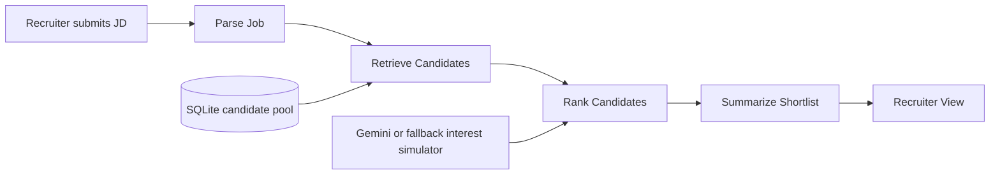

# TalentScout

TalentScout is the Deccan Catalyst submission for the `AI-Powered Talent Scouting & Engagement Agent` problem statement.

The app takes a job description, pulls the best-fit candidates from a sourced talent pool, runs a short outreach simulation to estimate interest, and returns a recruiter-ready shortlist with `Match Score`, `Interest Score`, and a final combined rank.

## What is in the app

- JD parsing into structured hiring criteria
- candidate retrieval from a local candidate pool
- score breakdown with strengths and gaps
- outreach simulation for interest estimation
- ranked shortlist with a recruiter summary

## How the flow works

1. Recruiter pastes a job description.
2. LangGraph runs:
   `parse_job -> retrieve_candidates -> rank_candidates -> summarize_shortlist`
3. The UI shows extracted requirements, shortlist ranking, score breakdown, and the outreach transcript for each candidate.

## Stack

- FastAPI
- Jinja templates
- Tailwind via CDN
- LangGraph
- Gemini `2.5 Flash` when `GEMINI_API_KEY` is available
- SQLite for the demo dataset
- scikit-learn TF-IDF similarity for profile matching

## Candidate source

This build uses a sourced talent pool stored locally instead of live LinkedIn scraping.

That choice was deliberate:

- it is more stable for a timed hackathon demo
- it avoids scraping risk and rate-limit issues
- it still demonstrates candidate discovery, matching, and ranking clearly

The ingestion layer can later be extended with ATS exports, recruiter CSV uploads, resumes, or approved profile connectors.

## Current retrieval approach

The current build does not use embeddings or a vector database.

Candidate discovery is handled in two steps:

- a lightweight lexical retrieval pass over the sourced talent pool
- TF-IDF based semantic similarity between the JD and candidate profile text

This kept the submission simpler to deploy and easier to explain during the demo while still giving a meaningful ranking signal.

## Next iteration

The next technical upgrade would be:

- generate embeddings for job descriptions and candidate summaries
- store vectors in `pgvector` or another vector store
- run hybrid retrieval with keyword filtering plus vector similarity

The current pipeline structure was kept simple on purpose so that upgrade can be added without changing the recruiter-facing flow.

## Architecture

Architecture diagram:



Detailed architecture note

## Scoring

### Match Score

Weighted out of 100:

- `35` hard-skill overlap
- `20` experience and seniority fit
- `15` domain fit
- `15` location plus notice-period fit
- `15` semantic similarity

### Interest Score

If Gemini is configured, the app asks the model for a short candidate reply flow and an interest score.

If Gemini is not configured, the fallback scorer estimates interest from:

- skill alignment
- work-mode alignment
- notice period
- compensation expectation

### Final score

```text
final_score = 0.7 * match_score + 0.3 * interest_score
```

## Project structure

```text
app/
  app.py
  config.py
  data/candidates.json
  models.py
  services/
    llm.py
    pipeline.py
    repository.py
    scoring.py
  templates/index.html
tests/
main.py
```

## Local setup

### Install dependencies

```bash
uv sync
```

### Optional Gemini setup

```bash
cp .env.example .env
```

Then set:

```text
GEMINI_API_KEY=your_key_here
```

### Run the app

```bash
uv run python main.py
```

Open `http://127.0.0.1:8000`

### Run tests

```bash
uv run pytest
```

## API example

`POST /api/analyze`

```json
{
  "title": "Senior AI Engineer",
  "company": "Deccan AI Labs",
  "location": "Remote - India",
  "employment_type": "Full-time",
  "description": "Deccan is hiring a Senior AI Engineer with 4+ years experience in Python, FastAPI, LLM systems, LangGraph, RAG, Postgres, and remote collaboration.",
  "top_k": 5
}
```

## Sample output

```json
{
  "recruiter_summary": "Rohan Bhasin leads the shortlist with a final score above 85 and the current batch includes hot and warm candidates ready for follow-up."
}
```

## Deployment

### Railway

- Build command: `uv sync`
- Start command: `uv run uvicorn app.app:app --host 0.0.0.0 --port $PORT`

### Render

- Build command: `uv sync`
- Start command: `uv run uvicorn app.app:app --host 0.0.0.0 --port $PORT`

### Vercel

Possible, but this app is better suited to Railway or Render for the current deadline.
