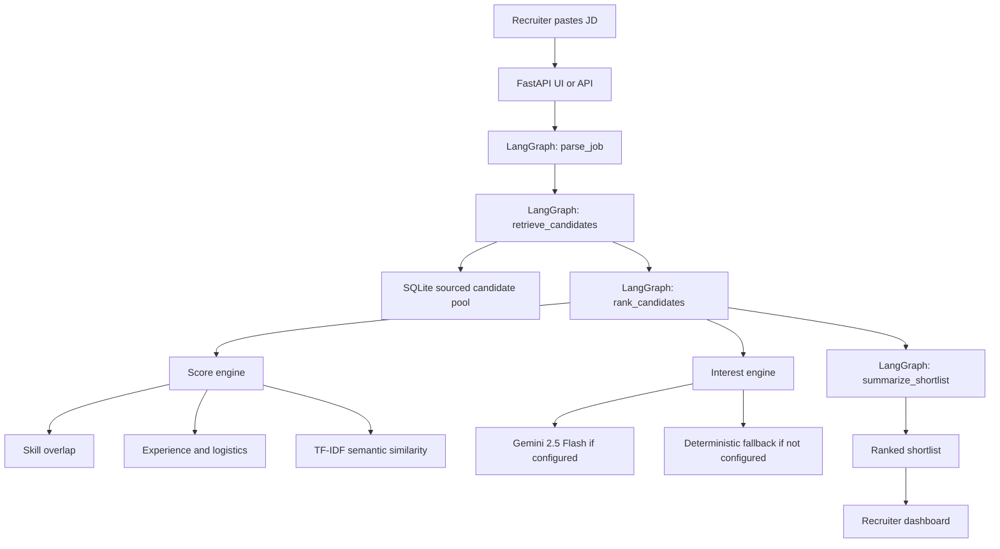

# TalentScout Architecture

This file is the compact architecture note for the Deccan Catalyst submission.

## Flowchart



## Notes

- `parse_job` turns free-form JD text into structured fields like must-have skills, domain keywords, work mode, and minimum experience.
- `retrieve_candidates` performs a fast lexical filter over the local sourced talent pool so only the strongest profiles move to the full scoring stage.
- `rank_candidates` combines match scoring and interest scoring.
- `summarize_shortlist` creates the summary shown at the top of the results page.

## Scoring summary

### Match Score

- `35` hard-skill overlap
- `20` experience fit
- `15` domain fit
- `15` location plus notice-period fit
- `15` semantic similarity

### Interest Score

- Gemini-backed short outreach transcript when API key is available
- deterministic fallback based on alignment, work mode, notice period, and compensation

### Final score

```text
0.7 * match_score + 0.3 * interest_score
```
